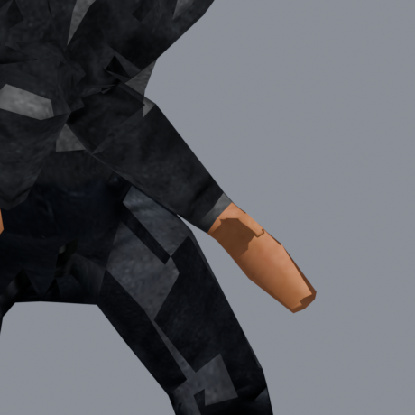
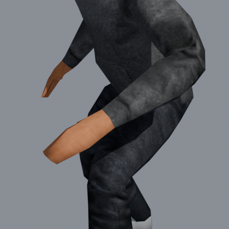
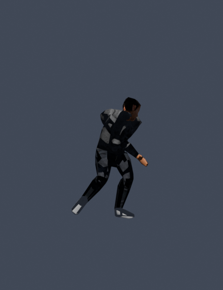
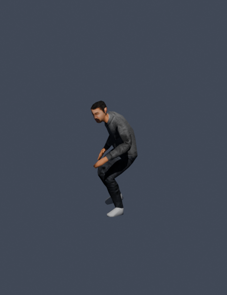
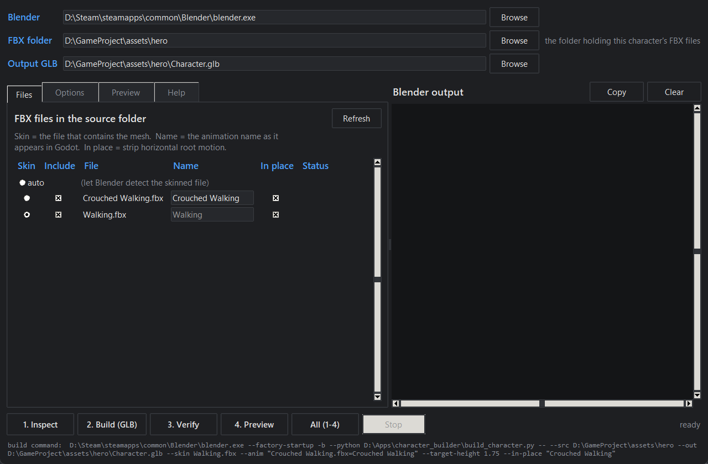
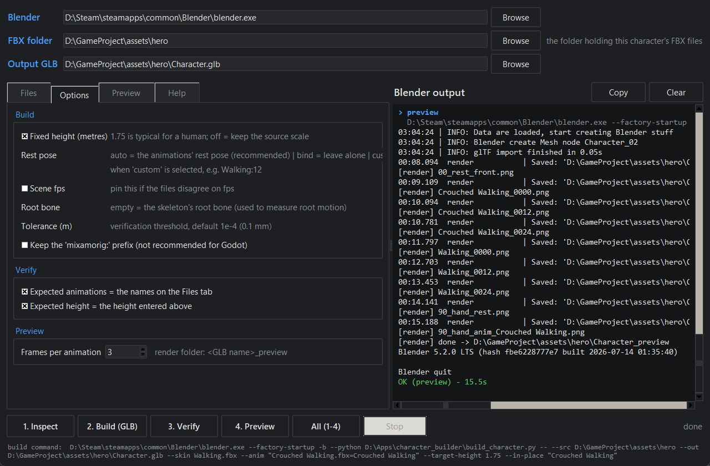
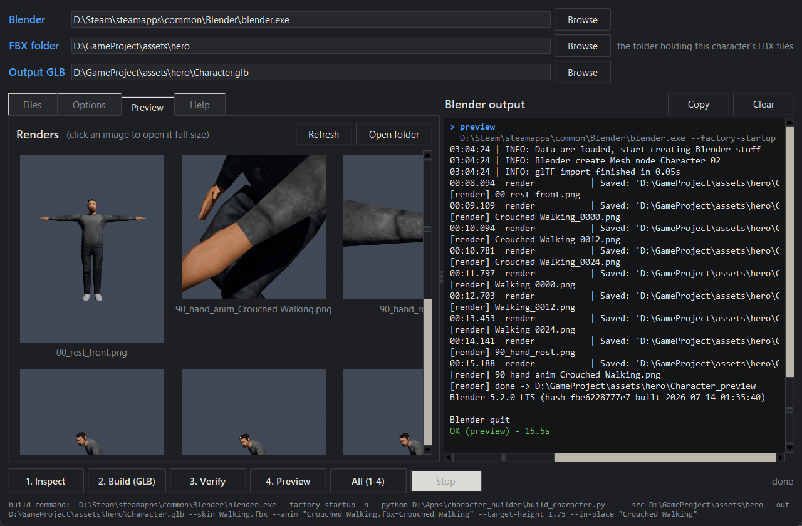
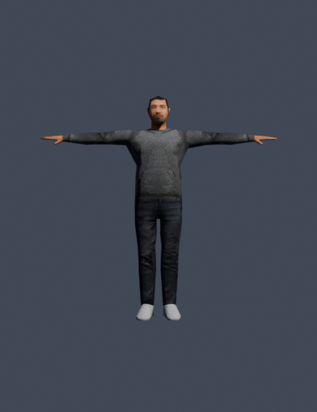

# easy-mixamo

Turn a folder of Mixamo FBX downloads into one `.glb` file that drops straight into
Godot, with every animation intact and nothing twisted.

[](LICENSE)


| Merged the obvious way | Merged with easy-mixamo |
|---|---|
|  |  |

Same character, same animation, same frame. On the left, the animation was moved onto the
character the way most scripts and tutorials do it. On the right, the same animation after
going through this tool.

---

## What problem does this solve?

Mixamo gives you **separate files**. You download the character once (with its mesh and
texture), then you download each animation on its own. Godot wants the opposite: **one
file** containing the character and all of its animations.

Merging them sounds easy, and that is the trap. The files do not agree on the character's
**rest pose** - the neutral pose every animation is measured against. Blender stores
animation as *changes relative to rest*, so if you simply move an animation from one file
to another, the difference between the two rest poses is silently added to every frame.

The damage is not obvious. The legs and torso still look roughly right; the **arms and
hands come out inverted, twisted or shattered**. You glance at a preview, it looks fine,
and you find out much later in the game.

| The obvious way | easy-mixamo |
|---|---|
|  |  |

This tool never copies animation data across. It watches where every bone actually is in
world space, frame by frame, then poses the target skeleton to land in the same places. It
does not care whether the rest poses agree.

In the example above the two files' rest poses were **3.54 m** apart. After rebuilding,
every bone on every frame lands within **0.007 mm** of the original.

---

## What you need

| | |
|---|---|
| **Blender** | 4.2 LTS or newer. You do not have to open it - the tool runs it in the background |
| **Python** | 3.9 or newer, only for the launcher and the app |
| **Godot** | 4.x. The output is standard glTF, so any engine that reads GLB works |

There is nothing to install with `pip`. The heavy lifting happens inside Blender's own
Python.

Get the tool:

```bash
git clone https://github.com/ard0x10/easy-mixamo.git
cd easy-mixamo
```

Check that everything is in place:

```bash
python easymixamo.py doctor
```

```
easy-mixamo doctor
  python  : 3.14.6  (win32)
  scripts : all present in D:\Tools\easy-mixamo
  blender : D:\Steam\steamapps\common\Blender\blender.exe
  version : Blender 5.2.0 LTS
  tkinter : available (the GUI will work)

setup looks good
```

Blender is found automatically: the `BLENDER` environment variable first, then `blender`
on your PATH, then the usual install locations for your system, including Steam libraries
on any drive. If it is somewhere unusual, pass `--blender <path>` or point it out in the
app.

---

## Step 1: download from Mixamo the right way

This part matters more than anything in the tool. Get it wrong and no software can repair
it afterwards.

| What | Settings |
|---|---|
| The character, once | Format **FBX Binary (.fbx)**, Pose **With Skin** |
| Every animation | Format **FBX Binary (.fbx)**, Skin **Without Skin**, 30 fps, Keyframe Reduction **none** |
| Animations you want to drive from code | tick **In Place** |

The one rule that people trip over: download the animations **while your character is
selected** in Mixamo. Animations taken from a different character have different bone
lengths, and this tool will refuse to build rather than produce something subtly wrong.
That case needs real retargeting, which is a different job.

Forgot to tick **In Place**? It can be stripped afterwards, no need to download again.

Put each character's files in their own folder, anywhere you like:

```
D:\GameProject\assets\hero\
    Walking.fbx              <- the character, downloaded With Skin
    Crouched Walking.fbx     <- an animation
    Idle.fbx                 <- another animation
```

Do not copy the files into the easy-mixamo folder, and do not move easy-mixamo next to
your files. You point the tool at a folder; the tool itself is installed once and stays
where it is.

---

## Step 2: run it

### The app (recommended)

Double-click **`EasyMixamo.bat`** on Windows, run **`./easymixamo.sh`** on macOS or Linux,
or type `python easymixamo.py gui` anywhere.



Pick your **FBX folder** at the top and the table fills itself in. For each file you can
set:

- **Skin** - which file holds the character's mesh. Leave it on *auto* and Blender finds
  it by looking for the mesh.
- **Include** - untick to leave an animation out of the build.
- **Name** - the name the animation will have in Godot. Rename freely; `Crouched
  Walking.fbx` can arrive as `Crouch`.
- **In place** - strip the horizontal movement, so the character animates on the spot and
  you move it from code.

The **Options** tab holds everything else. The defaults are sensible; the one worth
setting is the height.



- **Fixed height** - Mixamo characters are around 4.6 m tall in Blender units. Set 1.75
  and the character comes out human-sized, which saves you fighting scale in Godot.
- **Rest pose** - leave it on *auto*. This is the setting that fixes the twisted arms.
- **Tolerance** - how far a bone is allowed to drift before the build is rejected. The
  default is 0.1 mm.

Then press **All (1-4)**. The four steps run in order: inspect, build, verify, preview.
Blender's output streams into the right-hand panel as it happens, in green when a step
passes and in red when it does not. Nothing is written unless the result passes
verification.



When it finishes you land on the **Preview** tab: rendered stills of the rest pose and of
every animation. Look at them. A rest pose problem is visible here in a second and would
cost you an hour in Godot.

The line along the bottom always shows the exact command that will run, so you can copy it
into a terminal any time you want to script the same build.

Your settings are remembered between sessions:

| Platform | Settings file |
|---|---|
| Windows | `%APPDATA%\easy-mixamo\gui_settings.json` |
| macOS | `~/Library/Application Support/easy-mixamo/gui_settings.json` |
| Linux | `~/.config/easy-mixamo/gui_settings.json` |

### The command line

Same four steps, no window. `--src` defaults to the current folder and the output to
`<folder>/Character.glb`, so usually the subcommand is all you type:

```bash
cd D:\GameProject\assets\hero

python easymixamo.py inspect
python easymixamo.py build --target-height 1.75 --in-place "Crouched Walking"
python easymixamo.py verify --expect-height 1.75
python easymixamo.py preview
```

Or all four at once:

```bash
python easymixamo.py all --target-height 1.75 --in-place "Crouched Walking"
```

**Always run `inspect` first on a new set of files.** It tells you which file is the
skinned one, whether the skeletons match, and how far apart the rest poses are - before
anything is written:

```
bone LENGTHS (reference: 'Walking.fbx')  -> is it the same skeleton?
  Crouched Walking.fbx     max diff 0.001% (LeftHand)  SAME SKELETON

REST POSE (reference: 'Walking.fbx')  -> can actions be moved across directly?
  Crouched Walking.fbx     max diff   3.5356 m (RightHandIndex4)  DIFFERENT -> copying channels would twist the arms and hands
```

Every step prints `OK` or `FAILED` and returns a matching exit code, so this drops into a
build script or CI unchanged. Blender's own logging is hidden unless something goes wrong;
add `--show-log` to see all of it.

| Command | Options |
|---|---|
| `inspect` | `--src` |
| `build` | `--src --out --skin --anim --rest --target-height --in-place --root-bone --fps --keep-prefix --tolerance --blend` |
| `verify` | `--glb --expect-anims --expect-height` |
| `preview` | `--glb --preview-out --shots` |
| `all` | everything above |
| `gui` | opens the app |
| `doctor` | checks Blender, the scripts and tkinter |

`--blender <path>` and `--show-log` work everywhere. Repeatable options are simply
repeated: `--in-place Walking --in-place Running`.

---

## Step 3: what you get

```
D:\GameProject\assets\hero\
    Character.glb              <- import this into Godot
    Character_source.blend     <- the merged scene, in case you want to keep working on it
    Character_preview\         <- the rendered stills
```



The rest pose of the finished character. This is what Godot's Skeleton3D will show, and it
now matches the direction the animations were authored in.

A few things to know once it is in Godot:

| Topic | What to do |
|---|---|
| Scale | If you skipped `--target-height`, the character keeps Mixamo's scale. Set **Root Scale** on the Import tab - the build output prints the number you need |
| Looping | Animations arrive without looping. **Advanced Import Settings** -> select the animation -> **Loop Mode = Linear** |
| Root motion | AnimationTree -> **Root Motion Track** = `Skeleton3D:Hips`, then `get_root_motion_position()`. Or use `--in-place` and move the character from code |
| Bone names | The `mixamorig:` prefix is stripped, because `:` separates node paths in Godot. `--keep-prefix` turns that off, but do not use it with Godot |
| Double sided | Mixamo materials are double sided and the tool leaves that alone, because single-sided hair and cloth develop holes. Turn on backface culling in Godot if you want it |
| Feet | `verify` reports whether the feet sit at z=0, so you know whether to offset the model |

---

## Build options in full

| Option | What it does |
|---|---|
| `--src <folder>` | **Required.** The folder holding the FBX files |
| `--out <file.glb>` | Output path (default `<src>/Character.glb`) |
| `--skin <File.fbx[=Name]>` | Which file is the skinned one. Left out, the first file containing a mesh is used |
| `--anim <File.fbx[=Name]>` | An animation, **repeatable**. Left out, every FBX except the skinned one |
| `--rest auto\|bind\|<Name>:<frame>` | Which rest pose to bind the mesh to. `auto` is what you want |
| `--target-height <metres>` | Scale the character to this height, e.g. `1.75` |
| `--in-place <Name>` | Strip horizontal root motion from this animation, **repeatable** |
| `--root-bone <Name>` | Bone used to measure root motion (default: the skeleton's root) |
| `--fps <n>` | Scene fps, if the files disagree |
| `--keep-prefix` | Keep the `mixamorig:` prefix (not for Godot) |
| `--tolerance <metres>` | How far a bone may drift before the build fails (default `1e-4`) |
| `--blend <file>` | Where to save the `.blend` |

`--anim "Walking.fbx=Walk"` imports that file under the name `Walk`. Without `=Name` the
file name is used.

### What `--rest` actually does

The skinned file's bind pose usually does not face the same way as the animations. `--rest
auto` rebinds the mesh onto the pose the animations were authored against, which means
Skeleton3D faces the right way, BoneAttachment3D behaves, and Godot's humanoid retargeting
works. Use `--rest bind` only if you specifically need the original bind pose left alone.

---

## If something goes wrong

| Message or symptom | What it means |
|---|---|
| `bone lengths differ from the skinned rig by X%` | Those animations came from a different Mixamo character. Download them again with your character selected |
| `these bones of the skinned rig are missing: [...]` | Same cause - the animation file has a different skeleton |
| `baked animation does not match the source` | Verification did its job and nothing was written. Please open an issue |
| `no FBX contains a mesh` | The character was downloaded **Without Skin**. Download it again With Skin |
| `<file> contains no action` | That file has no animation in it |
| `animation '<name>' never moves any bone` | The animation really is empty. Check what you downloaded |
| Hands inverted in Godot | A rest pose mismatch. Run `inspect`, and make sure nothing else in your pipeline is copying animation channels |
| Character enormous or tiny | That is Mixamo's scale. Use `--target-height 1.75`, or set Root Scale in Godot |
| Blender not found | Set the `BLENDER` environment variable, or pass `--blender <path>`. `python easymixamo.py doctor` shows what was detected |

**A note for PowerShell users.** If you call Blender directly instead of going through
`easymixamo.py`, add `2>$null`. Blender writes progress to stderr, and PowerShell 5.1 turns
that into a `NativeCommandError` that makes a successful build look like a failure.
`easymixamo.py` handles this for you.

---

## Under the hood

Four scripts, each doing one job. `easymixamo.py` and the app both just run them through
Blender, so you can call them directly if you prefer:

```bash
blender --factory-startup -b --python <script.py> -- <arguments>
```

`--factory-startup` is required - it keeps your own add-ons out of the way.

| File | Job |
|---|---|
| `EasyMixamo.bat` / `easymixamo.sh` | Launchers for the app |
| `gui.py` | The app itself (tkinter) |
| `easymixamo.py` | Command line front end, cross platform |
| `blender_locator.py` | Finds Blender on Windows, macOS and Linux |
| `inspect_fbx.py` | Pre-flight check and rest pose comparison |
| `build_character.py` | The real work: merge, re-solve, self-verify, export |
| `verify_glb.py` | Checks the finished GLB independently (exit code 1 on a problem) |
| `render_preview.py` | The preview stills |

The build checks itself before writing: every bone on every frame of every animation is
compared against the source file, and if anything is off by more than the tolerance, the
build fails and writes nothing. `verify_glb.py` then re-reads the finished file from disk,
in a clean scene, as a second opinion.

### Pitfalls worth knowing

Every one of these caused a real bug here. If you are writing something similar, this is
the part worth reading.

1. **Rest pose mismatch.** The whole reason this tool exists. Matching bone *names* is not
   enough; the rest *poses* have to be compared too.

2. **Captured matrices carry the object scale.** The 3x3 part of `arm.matrix_world @
   pb.matrix` has the FBX's 0.01 unit scale baked in, and it is not cancelled when the
   object matrix later becomes identity. Divide it out at capture time or it leaks into
   the solver as metres of error.

3. **Use one coordinate space.** Capture everything first, then convert centimetres to
   metres, then solve. Changing the object matrix in between walks you into pitfall 2.

4. **Never use `Armature.data.transform()`.** It changes rest data while the evaluated pose
   goes stale, so what you measure is relative to the old rest.
   `bpy.ops.object.transform_apply()` does the right thing.

5. **Blender 4.4+ slotted actions.** `animation_data.action = act` is not enough any more;
   the `action_slot` has to be assigned too. Without it the action drives nothing, and you
   end up measuring the rest pose without noticing:
   ```python
   ad.action = act
   if ad.action_slot is None and act.slots:
       ad.action_slot = act.slots[0]
   ```

6. **Renaming bones detaches animation.** Blender fixes vertex groups automatically, but it
   only repairs the animation channels of the action that is *assigned at that moment*. The
   skinned file's own animation therefore has to be sampled **before** the `mixamorig:`
   prefix is stripped - otherwise a character downloaded With Skin together with an
   animation arrives in Godot with that animation silently empty.

7. **Do not assume the alpha channel, measure it.** Mixamo wires the diffuse texture into
   the alpha input as well. If the texture is fully opaque, that link still makes the GLB
   `alphaMode: BLEND`, and Godot draws the character in the transparent pass. Measure the
   pixels and drop the link when there is no real transparency.

8. **The `glTF_not_exported` artefact.** Blender's glTF *importer* adds an Icosphere to the
   scene in a `glTF_not_exported` collection. It is not in the file and Godot never sees
   it, but a verification script will count it as a mesh unless it filters it out.

9. **The rest pose cannot be changed on meshes with shape keys.** `modifier_apply` refuses.
   The build detects this and tells you; carry on with `--rest bind`.

10. **"Is this animation empty?" cannot be answered from the root bone.** An in-place
    animation keeps its root still on purpose. Sample every bone, over several frames - a
    cyclic motion can return to its starting pose exactly at the midpoint.

11. **Action names are not filenames.** Straight out of an FBX they look like
    `Armature|mixamo.com|Base Layer`, and `|` and `:` are not legal in filenames on
    Windows.

---

## Contributing

Issues and pull requests are welcome. Before opening a PR, run the whole chain on a real
Mixamo set - a character downloaded With Skin plus at least one separate animation - and
make sure `verify` still exits 0:

```bash
python easymixamo.py all --src <your folder> --target-height 1.75
```

If you found a new Blender pitfall, add it to the list above. That section is the most
valuable part of this repository.

## License

[MIT](LICENSE). Mixamo assets belong to Adobe and are covered by Adobe's terms; this
repository contains none of them.
